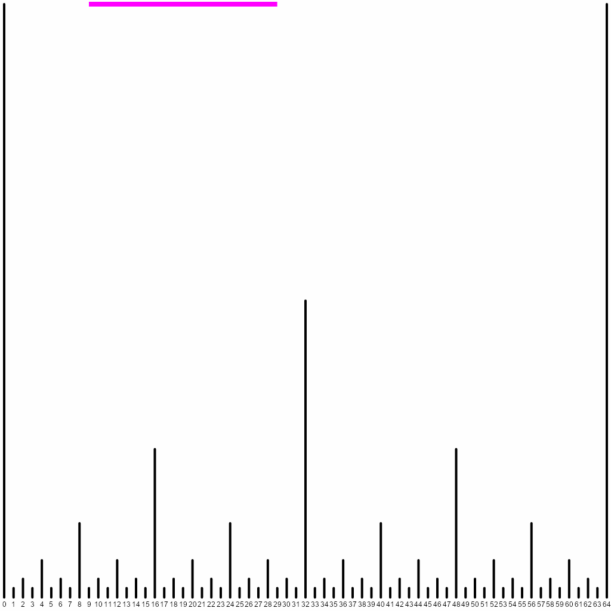
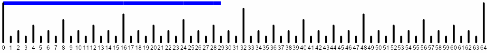
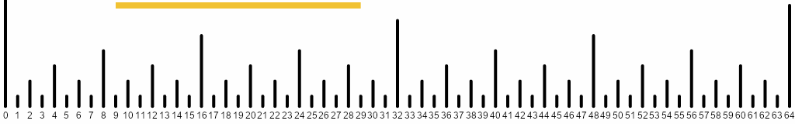

+++
title = 'Fenwick Trees Are Nothing But…'
date = 2025-01-14T03:35:12+01:00
draft = false
summary = "A visual perspective on Fenwick tree intuition"
description = "A visual perspective on Fenwick tree intuition"
toc = true
readTime = true
autonumber = false
math = true
tags = ["fenwick", "segment-tree", "algorithms"]
showTags = false
hideBackToTop = false
+++

## Introduction
The explanations of *[Fenwick trees](https://en.wikipedia.org/wiki/Fenwick_tree)*,
or *Binary Indexed Trees*, that I could find (some are listed in the
[references](#references) below) seem to lack proper intuition. They describe
the data structure in a way that makes it hard to come up with it from scratch.

This is a problem because good intuitive understanding of a data structure gives
you the ability to adapt it to new circumstances and to derive new ones
with desired properties. In this post, we'll consider a very useful
perspective on Fenwick trees and illustrate its merits by creating
a [dynamic range minimum queries](https://cses.fi/problemset/task/1649) adaptation.

## Segment trees
In particular, we'll show how Fenwick trees are in some sense just a cut down
version of *segment trees*.

A [segment tree](https://cp-algorithms.com/data_structures/segment_tree.html)
divides the array in consideration into two halves, each of
which is further divided in half, and so on, until segments of length 1 are formed.
These become the leaves of a binary tree, whose root is a segment covering the entire
span of the array and the children of any non-leaf segment are its halves.[^1]

[^1] One can alternatively start with length-1 segments and joining them into
pairs, then joining those pairs into quartuplets, etc. This way, even for non-power-of-2
array sizes, the splits will be exactly as illustrated further.

It is immediately obvious that the height of the tree is logarithmic in the number
$n$ of array elements, since each child half is approximately twice shorter than
the parent segment (well, due to rounding, one "half" can be larger than a proper
$1/2$ of the whole, but it still is guaranteed not to exceed its $2/3$).

In order to perform range queries and updates on such a tree, the segment
representing the range is split into parts corresponding to the tree nodes.
This is typically done in a recursive fashion: starting from the root, the
segment in question is either entirely contained in the left or the right child
or divided in two at the midpoint separating the children. A crucial observation
is that only at most one such division can end up in both subsegments not
coinciding with the child segments.

This is illustrated in the following animation, where the left (red) and right
(blue) parts of an initial segment represent the results of such division.
As it can be seen, these parts are "stuck" with one end to an endpoint of one of
the children on all subsequent levels. Therefore in total there are at most two
segment parts of interest at each level, leading to $O(\log n)$ traversal. On
the way back, one can recompute segment parameters from those of their children.



You might have noticed that $n = 64 = 2^6$ in this illustration. This has been
chosen deliberately, so that splitting points are exactly in the middle of the
segments. The height of the cutting spikes was chosen to be the largest constituent
power of $2$, i.e. $2^h$ for midpoints at $(2k + 1) 2^h$.

## Enter Fenwick trees

Let's now focus on those examples where the initial segment already touches the
leftmost spike at $0$. Here are specifically such examples (to keep things compact,
I've replaced the heights $2^h$ with $h + 1$):


Note that to represent such segments, we only need the blue parts.
Each blue segment runs from the tip of a spike to the left until it hits a higher
spike. The closest higher spike to the left of a point $x = (2k + 1)2^h$ is
$k \cdot 2^{h + 1} = x - 2^h = x - height(x)$, where $height(x)$ is the largest
divisor of $x$ that is a power of $2$. Alternatively, it is the value $LSB(x)$
of the least significant bit of $x$; in the ubiquitous two's complement system
for representing negative numbers, $LSB(x) = x \mathop{\&} -x$, where $\&$ is
bitwise AND.

Now observe that in order to compute sums on the intervals of the original array,
we only need to be able to compute sums on such prefix segments (touching zero),
because $sum([l, r)) = sum([0, r)) - sum([0, l))$.

And thus, by associating with each spike a blue segment starting from its tip and
going to the left, we can store partial sums on those blue segments. To compute
a prefix sum for a given $[0, r)$ segment, we explicitly iterate through those
blue segments by repeatedly subtracting $LSB(x)$ from the current right endpoint.
This is exactly what a Fenwick tree is about.

This way, a Fenwick tree can be seen as a certain half of a segment tree. Note
that for $n$ different from a power of two, a top-down segment tree would arrive
at splitting unevenly, whereas a Fenwick tree always splits in the way shown, as
if $n$ is rounded up to a power of two.

For point updates, one needs to enumerate the spikes whose partial sums are
containing the given point. One can see that it's achieved by iterating through
subsequently increasing spikes to the right --- going from $x = (2k + 1)2^h$ to
$x = (2k + 2)2^h = (k + 1)2^{h + 1} = x + 2^h = x + LSB(x)$.

For comparison with the later extension of the Fenwick tree, here's the code.
Note the $O(n)$ initialization from a given list of values --- it is left as an
exercise for the reader to figure it out using the newly acquired visual
intuition.

```python
def lsb(n: int) -> int:
    return n & -n

class RangeSum:
    def __init__(self, initial_values: Iterable[Number]) -> None:
        values = list(initial_values)
        self.n = len(values)
        self.fenwick = [0] + values
        for pos in range(1, self.n + 1):
            next_ = pos + lsb(pos)
            if next_ <= self.n:
                self.fenwick[next_] += self.fenwick[pos]

    def modify(self, pos: int, add: Number) -> None:
        # We start with updating the segment
        # whose exclusive right end is `pos + 1`
        pos += 1
        while pos <= self.n:
            self.fenwick[pos] += add
            pos += lsb(pos)
            if pos == 0:
                break

    def query(self, left: int, right: int) -> Number:
        return self._query(right) - self._query(left)

    def _query(self, right: int) -> Number:
        result = 0
        while right > 0:
            result += self.fenwick[right]
            right -= lsb(right)
        return result
```

This data structure can be used in [CSES problem "Dynamic Range Sum Queries"](https://cses.fi/problemset/task/1648/)
(note that modifications there are absolute rather than relative and the indexing
starts from 1, so additional care is needed on top).

## Extending for range minima

If we want to compute $min([l, r))$, we are out of luck with the approach of the
original Fenwick trees. That's because one cannot reduce computing minima on
arbitrary $[l, r)$ segments to those of the kind $[0, r)$.

But we know that segment trees can be trivially applied to this task. Therefore
let's go back to the original animation and see what we're missing: it's
precisely all the red segments! We can also associate them with the spikes on
whose tips they rest.



Let's store minima on blue parts in one array (`left`) and on red parts in
another (`right`)[^2]. Observe that the underlying (original) array items are stored
between the two arrays of our Fenwick structure in the combination of all the
length-1 blue and red parts.

[^2]: Note that we have previously called the blue segments "right" and the red
segments "left". That's how they relate to the first division of a "falling"
segment. The opposite notation comes from looking at their orientation relative
to the spike which is responsible for storing the segment data.

When computing the minimum on the given segment $[l, r)$,
we iterate through the red segments by repeatedly adding $LSB(current\_l)$
to $current\_l$ (starting from $l$) until it meets or exceeds $r$, and we
iterate through the blue segments by repeatedly subtracting $LSB(current\_r)$
from $current\_r$ (starting from $r$). Note that both processes meet at the
first split point of the "falling" segment.

After a point update, we "climb up" the underlying segment tree, understanding
whether the current segment $[l, r)$ is the left or the right child (in the
segment tree sense) of its parent by comparing $height(l)$ and $height(r)$. Then
the minimum over a parent segment is trivially the minimum between its child
segment minima.

## Show me the code
Sure! Here it is:
```python
INF = float('inf')

class RangeMinimum:
    def __init__(self, initial_values: Iterable[Number]) -> None:
        values = list(initial_values)
        self.n = len(values)
        self.left = [INF] + values   # "blue" - left of a spike tip
        self.right = values + [INF]  # "red" - right of a spike tip
        for pos in range(1, self.n + 1):
            next_ = pos + lsb(pos)
            if next_ <= self.n:
                self.left[next_] = min(self.left[next_],
                                       self.left[pos])
        for pos in range(self.n, 0, -1):
            prev = pos - lsb(pos)
            if prev >= 0:
                self.right[prev] = min(self.right[prev],
                                       self.right[pos])

    def modify(self, pos: int, new_value: Number) -> None:
        # Point modification at `pos`
        # is a modification of `[pos, pos + 1)`.
        left = pos
        right = pos + 1
        if left % 2 == 0:
            self.left[right] = new_value
            right += 1
        else:
            self.right[left] = new_value
            left -= 1
        # "Climb" up the tree.
        # The left and right children of a certain segment
        # are associated in our data structure with its midpoint.
        while left > 0 or right <= self.n:
            mid = (left + right) // 2
            mid_min = min(self.left[mid], self.right[mid])
            if right <= self.n and (left == 0
                                    or lsb(left) > lsb(right)):
                self.left[right] = mid_min
                right += lsb(right)
            else:
                self.right[left] = mid_min
                left -= lsb(left)

    def query(self, left: int, right: int) -> Number:
        result = INF
        while right > 0 and right - lsb(right) >= left:
            result = min(result, self.left[right])
            right -= lsb(right)
        while left > 0 and left + lsb(left) <= right:
            result = min(result, self.right[left])
            left += lsb(left)
        return result
```
Try this data structure in the [CSES problem "Dynamic Range Minimum Queries"](https://cses.fi/problemset/task/1649/).

While writing this post, I came across the paper [M. Dima, R. Ceterchi. Efficient Range Minimum Queries using Binary Indexed Trees](https://ioinformatics.org/journal/v9_2015_39_44.pdf),
which addresses the same scenario. However, to the extent I could understand their
update operation, it "climbs" `left` and `right` separately.

## Another example
Say we're computing range sums and want to be able to increase the numbers on an
entire interval at once (as in the setting of [CSES "Range Update Queries"](https://cses.fi/problemset/task/1651)).
There's actually a [clever trick](https://cp-algorithms.com/data_structures/fenwick.html#range-operations)
that allows reformulating the problem in terms of two point-updated Fenwick trees.
But we can use our extension of the Fenwick tree with both `left` and `right`
segments for this purpose instead, distributing the increases across range's
constituent subsegments:
```python
class RangeUpdates:
    def __init__(self, initial_values: Iterable[Number]) -> None:
        initial_values = list(initial_values)
        self.n = len(initial_values)
        self.left = [0] * (self.n + 1)
        self.right = [0] * (self.n + 1)
        # As in the tree for minima,
        # the initial array is spread among length-1 segments.
        for pos, value in enumerate(initial_values):
            if pos % 2 == 0:
                self.left[pos + 1] = value
            else:
                self.right[pos] = value

    def query(self, pos: int) -> None:
        result = 0
        left = pos
        right = pos + 1
        if left % 2 == 0:
            result = self.left[right]
            right += 1
        else:
            result = self.right[left]
            left -= 1
        while left > 0 or right <= self.n:
            if right <= self.n and (left == 0
                                    or lsb(left) > lsb(right)):
                result += self.left[right]
                right += lsb(right)
            else:
                result += self.right[left]
                left -= lsb(left)
        return result

    def modify(self, left: int, right: int, addend: Number) -> Number:
        while right > 0 and right - lsb(right) >= left:
            self.left[right] += addend
            right -= lsb(right)
        while left > 0 and left + lsb(left) <= right:
            self.right[left] += addend
            left += lsb(left)

```
Note how the new `query` and `modify` are a mirror image of, respectively,
`modify` and `query` from above.

## Closing remarks
We have essentially shown that Fenwick trees with both `left` and `right` arrays
are a different layout of the relevant segment tree. This means one can in
principle write the recursive traversal code for the implicit segment tree
(when $n$ is a power of two, the two children of the $[0, n)$ root are associated
with the spike at $n/2$) --- but the purpose of that, other than showing the
equivalence in expressive power, is dubious.

Fenwick trees tend to be faster than segment trees in tests (e.g. [here](https://ioinformatics.org/journal/v9_2015_39_44.pdf)),
because they avoid climbing down the tree to find the constituent parts of a
segment --- those parts are enumerated explicitly in time proportional to their
count. Therefore it makes sense considering Fenwick trees as a
replacement to segment trees where appropriate.

Finally, [S. Marchini, S. Vigna. Compact Fenwick trees for dynamic ranking and selection](https://arxiv.org/abs/1904.12370)
gives another illustration of Fenwick trees and discusses performance implications
of the standard tree layout, proposing certain modifications for cache
friendliness.

The code for drawing the animations is available [on GitHub](https://github.com/kartynnik/fenwick-animation).

## References
* [Fenwick tree --- Wikipedia](https://en.wikipedia.org/wiki/Fenwick_tree)
* [Fenwick tree --- Algorithms for Competitive Programming](https://cp-algorithms.com/data_structures/fenwick.html)
* [Binary Indexed Trees --- Topcoder](https://www.topcoder.com/thrive/articles/Binary%20Indexed%20Trees)
* [Basic Binary Indexed Tree --- Codeforces](https://codeforces.com/blog/entry/619)
* [BIT: What is the intuition… --- CS StackExchange](https://cs.stackexchange.com/questions/10538/bit-what-is-the-intuition-behind-a-binary-indexed-tree-and-how-was-it-thought-a)
* [Fenwick Tree vs. Segment Tree --- StackOverflow](https://stackoverflow.com/questions/64190332/fenwick-tree-vs-segment-tree)
* [M. Dima, R. Ceterchi. Efficient Range Minimum Queries using Binary Indexed Trees](https://ioinformatics.org/journal/v9_2015_39_44.pdf)
* [S. Marchini, S. Vigna. Compact Fenwick trees for dynamic ranking and selection](https://arxiv.org/abs/1904.12370)
