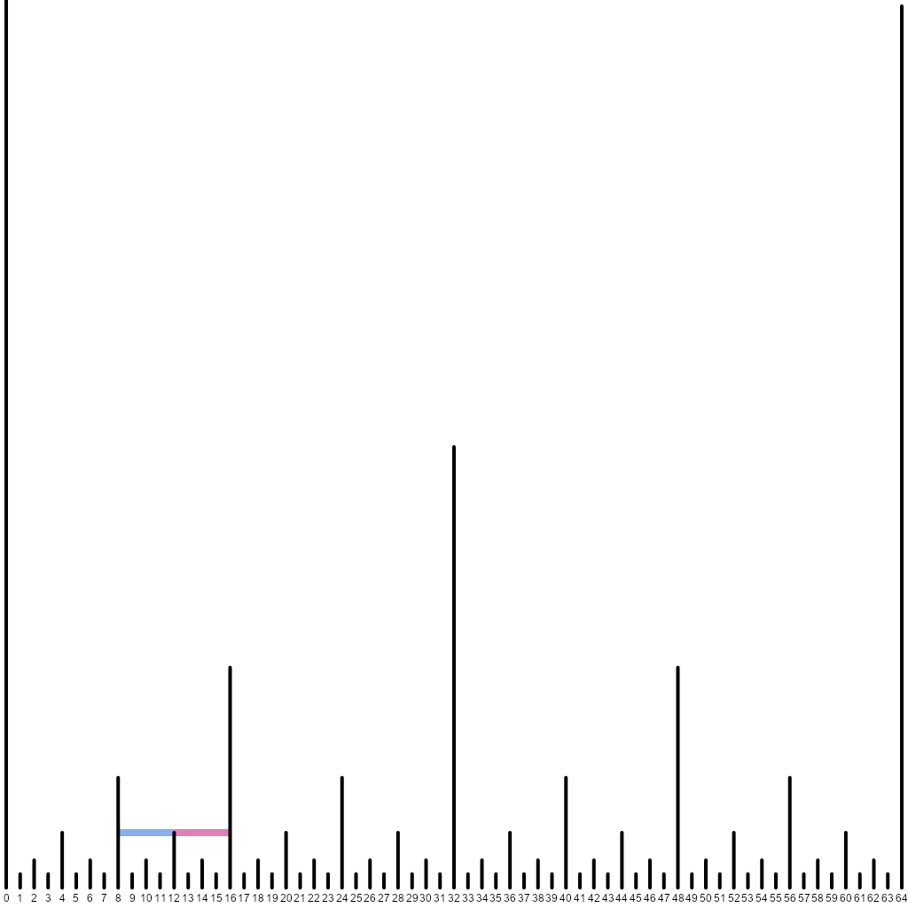

+++
title = 'Fenwick Trees Are Nothing But…'
date = 2025-01-14T03:35:12+01:00
draft = false
summary = "A visual perspective on Fenwick tree intuition"
description = "A visual perspective on Fenwick tree intuition"
toc = true
readTime = true
autonumber = false
math = true
tags = ["fenwick tree", "segment tree", "algorithms"]
showTags = false
hideBackToTop = false
+++

## Introduction
Most explanations of *[Fenwick trees](https://en.wikipedia.org/wiki/Fenwick_tree)* ---
or *Binary Indexed Trees* --- that I've seen (some are listed in the
[references](#references) below) describe the data structure in a way that makes
it hard to come up with it from scratch.

A good intuitive understanding of a data structure makes it easier to remember and
gives you the ability to derive new ones with desired properties. In this post,
we'll consider a very useful visual perspective on Fenwick trees and illustrate
its merits by creating a [dynamic range minimum queries](https://cses.fi/problemset/task/1649) adaptation.

## Segment trees
In particular, we'll show how Fenwick trees are in some sense just a cut down
version of *segment trees*.

A [segment tree](https://cp-algorithms.com/data_structures/segment_tree.html)
divides the array in consideration into two halves, each of
which is further divided in half, and so on, until segments of length $1$ are formed.
These become the leaves of a binary tree, whose root is a segment covering the entire
span of the array and the children of any non-leaf segment are its halves.[^bottomup]

[^bottomup]: One can alternatively start with length-$1$ segments and join them into
pairs, then join those pairs into quadruples, etc. This way, even for non-power-of-$2$
array sizes, the splits will be exactly as illustrated further.

For the number of array elements $n$ that is an integer power of two, the case
we'll focus on for now, this results in an even division each time, producing a
structure illustrated below. We mark left children as blue and right children as
pink for the reasons that will soon become apparent.[^blueroot]
Note how the black divider at a position $x$ rises $h$ levels above the leaves'
level where $x = (2k + 1) 2^h$, i.e. $h$ is the largest power of $2$ dividing $x$.

[^blueroot]: The root segment representing the entire array is painted blue
because it becomes the left child when the array is doubled.


It is immediately obvious that the height of the tree is logarithmic in the number
$n = 2^t$ of array elements, since each child half is twice shorter than the parent
segment.[^nonpower2] This is reflected in the fact that the tallest divider
(except the one at zero that has infinite height) has height $t$.

[^nonpower2]: In the non-power-of-$2$ case, due to rounding, one "half" can be larger
than a proper $1/2$ of the whole, but it is still guaranteed not to exceed its $2/3$.

In order to perform range queries and updates on such a tree, the segment
representing the range is split into parts corresponding to the tree nodes.
This is typically done in a recursive fashion: starting from the root, the
segment in question is either entirely contained in the left or the right child
or divided in two at the midpoint separating the children. A crucial observation
is that only at most one such division can end up in both subsegments not
coinciding with the child segments.

This is illustrated in the following animation, where the left (pink) and right
(blue) parts of an initial segment represent the results of such division.
As it can be seen, these parts are "stuck" with one end to an endpoint of one of
the children on all subsequent levels. Therefore in total there are at most two
segment parts of interest at each level, leading to $O(\log n)$ traversal. On
the way back, one can recompute segment parameters from those of their children.


## Enter Fenwick trees

Let's now focus on those examples where the initial segment already touches the
leftmost spike at $0$. Here are specifically such examples:


Note that to represent segments of this kind, we only need the blue parts.
Each blue segment runs from the tip of a divider spike to the left until it hits
a higher spike. Let's redraw our animation making the length of the divider spikes
correspond to the largest power of two dividing their position:


The closest higher spike to the left of a spike at $x = (2k + 1)2^h$ with height $2^h$
is at $k \cdot 2^{h + 1} = 2 k \cdot 2^h = x - 2^h = x - height(x)$, where $height(x)$ is the largest
divisor of $x$ that is a power of $2$. Alternatively, it is the value $LSB(x)$
of the least significant bit of $x$; in the ubiquitous two's complement system
for representing negative numbers, $LSB(x) = x \mathop{\&} -x$, where $\&$ is
bitwise AND.

Now observe that in order to compute sums on the intervals of the original array,
we only need to be able to compute sums on such prefix segments (touching zero),
because $sum([l, r)) = sum([0, r)) - sum([0, l))$. This means that of the full
segment tree we only need the following segments:


And thus, by associating with each spike a blue segment starting from its tip and
going to the left, we can store partial sums on those blue segments. To compute
a prefix sum for a given $[0, r)$ segment, we explicitly iterate through the
constituent blue segments by repeatedly subtracting $LSB(x)$ from the current
right endpoint. This is exactly what a Fenwick tree is about.

This way, a Fenwick tree can be seen as a certain "half" of a segment tree. Note
that for $n$ different from a power of two, a top-down segment tree would arrive
at splitting unevenly, whereas a Fenwick tree always splits in the way shown, as
if $n$ is rounded up to a power of two. The spikes after $n$ are thrown away
afterwards:


We will assume that the array indexing is zero-based; the prefix sum stored in $r$
corresponds to the segment $[r - LSB(r), r)$ of elements $r - LSB(r)$ through
$r - 1$ of the original array.

For point updates, one needs to enumerate the spikes whose left partial sums are
containing the given array item at index $i$. It's easy to see that the first
such partial sum is stored at $i + 1$. The rest can be found by iterating through
subsequently increasing spikes to the right --- going from $x = (2k + 1)2^h$ to
$x = (2k + 2)2^h = (k + 1)2^{h + 1} = x + 2^h = x + LSB(x)$. Here's an example of
how it looks like when updating the $11$th element, which would be stored in the
pink segment $[11, 12)$ if the tree were complete:


For comparison with the later extension of the Fenwick tree, here's the code.
Note the $O(n)$ initialization from a given list of values --- it is left as an
exercise for the reader to figure it out using the newly acquired visual
intuition.

```python
def lsb(x: int) -> int:
    # Note: returns 0 for `x == 0` although it should be infinity.
    #       Therefore `x == 0` should be special-cased in the code.
    return x & -x

class RangeSum:
    def __init__(self, initial_values: Iterable[Number]) -> None:
        values = list(initial_values)
        self.n = len(values)
        self.fenwick = [0] + values  # [0, 0) is an empty segment.
        for pos in range(1, self.n + 1):
            next_ = pos + lsb(pos)
            if next_ <= self.n:
                self.fenwick[next_] += self.fenwick[pos]

    def modify(self, pos: int, add: Number) -> None:
        # We start with updating the segment
        # whose exclusive right end is `pos + 1`.
        pos += 1
        while pos <= self.n:
            self.fenwick[pos] += add
            pos += lsb(pos)
            if pos == 0:
                break

    def query(self, left: int, right: int) -> Number:
        return self._query(right) - self._query(left)

    def _query(self, right: int) -> Number:
        result = 0
        while right > 0:
            result += self.fenwick[right]
            right -= lsb(right)
        return result
```

This data structure can be used in the [CSES problem "Dynamic Range Sum Queries"](https://cses.fi/problemset/task/1648/).
(Note that modifications there are absolute rather than relative and the indexing
starts from 1, so additional care must be taken on top. Additionally, solutions
in Python might need a speedup provided by PyPy in order to fit the time constraints.)

## Extending for range minima

If we want to compute $min([l, r))$, we are out of luck with the approach of the
original Fenwick trees. That's because one cannot reduce computing minima on
arbitrary $[l, r)$ segments to those of the $[0, r)$ kind.

But we know that segment trees can be trivially applied to this task. Therefore
let's go back to the original animation and see what we're missing: it's
precisely all the pink segments! We can also associate them with the spikes on
whose tips they rest.


Let's store minima on blue parts in one array (`left`) and on pink parts in
another (`right`)[^3]. Observe that the underlying (original) array items are stored
between the two arrays of our Fenwick structure in the combination of all the
length-$1$ blue and pink parts. With a particular divider spike at $x$ we
associate two ranges: $[x - LSB(x), x)$ and $[x, x + LSB(x))$. Here they are
depicted for $x = 12$:



[^3]: Note that we have previously called the blue segments "right" and the pink
segments "left". That's how they relate to the first division of a "falling"
segment. The opposite notation comes from looking at their orientation relative
to the divider spike which is responsible for storing the segment data.

Back to our segment splitting:


When computing the minimum on the given segment $[l, r)$ (like $[3, 37)$ in the
image above), we iterate through the pink segments by repeatedly adding $LSB(current\_l)$
to $current\_l$ (starting from $l$) until it meets or exceeds $r$, and then we
iterate through the blue segments by repeatedly subtracting $LSB(current\_r)$
from $current\_r$ (starting from $r$). Note that both processes meet at the
first split point of the "falling" segment.

*Exercise for the reader:* Suppose $l$ is has a binary representation of $\overline{X0Y}_2$
and $r$ is represented as $\overline{X1Z}_2$, where $X$ is their longest common binary prefix and
$Y$ and $Z$ are some suffixes of the same length. Show that the first split
occurs at $\overline{X10\ldots 0}_2$ and the above iterations from the left and
from the right converge at that point.

After a point update, we "climb up" the underlying segment tree, understanding
whether the current segment $[l, r)$ is the left or the right child (in the
segment tree sense) of its parent by comparing $height(l)$ and $height(r)$. Then
the minimum over a parent segment is trivially the minimum between its child
segment minima.

## Show me the code
Sure! Here it is:
```python
INF = float('inf')

class RangeMinimum:
    def __init__(self, initial_values: Iterable[Number]) -> None:
        values = list(initial_values)
        self.n = len(values)
        self.left = [INF] + values   # "blue" - left of a spike tip.
        self.right = values + [INF]  # "pink" - right of a spike tip.
        for pos in range(1, self.n + 1):
            next_ = pos + lsb(pos)
            if next_ <= self.n:
                self.left[next_] = min(self.left[next_],
                                       self.left[pos])
        for pos in range(self.n, 0, -1):
            prev = pos - lsb(pos)
            if prev >= 0:
                self.right[prev] = min(self.right[prev],
                                       self.right[pos])

    def modify(self, pos: int, new_value: Number) -> None:
        # Point modification at `pos`
        # is a modification of `[pos, pos + 1)`.
        left = pos
        right = pos + 1
        # Holds the minimum on [left, right).
        min_value = new_value
        # "Climb" up the segment tree.
        while left > 0 or right <= self.n:
            if right <= self.n and (left == 0
                                    or lsb(left) > lsb(right)):
                self.left[right] = min_value
                # We are about to extend the segment to the right,
                # and its new center will be at the current `right`.
                # Include the minimum over its right (pink) part.
                min_value = min(min_value, self.right[right])
                right += lsb(right)
            else:
                # We are about to extend the segment to the left,
                # and its new center will be at the current `left`.
                # Include the minimum over its left (blue) part.
                self.right[left] = min_value
                min_value = min(min_value, self.left[left])
                left -= lsb(left)

    def query(self, left: int, right: int) -> Number:
        result = INF
        while right > 0 and right - lsb(right) >= left:
            result = min(result, self.left[right])
            right -= lsb(right)
        while left > 0 and left + lsb(left) <= right:
            result = min(result, self.right[left])
            left += lsb(left)
        return result
```
Try this data structure in the [CSES problem "Dynamic Range Minimum Queries"](https://cses.fi/problemset/task/1649/).

While writing this post, I came across the paper [M. Dima, R. Ceterchi. Efficient Range Minimum Queries using Binary Indexed Trees](https://ioinformatics.org/journal/v9_2015_39_44.pdf),
which addresses the same scenario. However, to the extent I could understand their
update operation, it "climbs up" `left` and `right` separately with additional
bookkeeping.

## Another example
Say we're computing point sums and want to be able to increase the numbers on an
entire interval at once (as in the setting of [CSES's "Range Update Queries"](https://cses.fi/problemset/task/1651)).
There's actually a [clever trick](https://cp-algorithms.com/data_structures/fenwick.html#range-operations)
that allows reformulating the problem in terms of a usual Fenwick tree.
But we can use our extension of the Fenwick tree with both `left` and `right`
segments for this purpose instead, distributing the increases across range's
constituent subsegments:
```python
class RangeUpdates:
    def __init__(self, initial_values: Iterable[Number]) -> None:
        initial_values = list(initial_values)
        self.n = len(initial_values)
        self.left = [0] * (self.n + 1)
        self.right = [0] * (self.n + 1)
        # As in the tree for minima,
        # the initial array is spread among length-1 segments.
        for pos, value in enumerate(initial_values):
            if pos % 2 == 0:
                self.left[pos + 1] = value
            else:
                self.right[pos] = value

    def query(self, pos: int) -> None:
        result = 0
        left = pos
        right = pos + 1
        while left > 0 or right <= self.n:
            if right <= self.n and (left == 0
                                    or lsb(left) > lsb(right)):
                result += self.left[right]
                right += lsb(right)
            else:
                result += self.right[left]
                left -= lsb(left)
        return result

    def modify(self, left: int, right: int, addend: Number) -> Number:
        while right > 0 and right - lsb(right) >= left:
            self.left[right] += addend
            right -= lsb(right)
        while left > 0 and left + lsb(left) <= right:
            self.right[left] += addend
            left += lsb(left)

```
Note how the new `query` and `modify` are a mirror image of, respectively,
`modify` and `query` from above.

## Closing remarks
We have essentially shown that Fenwick trees with both `left` and `right` arrays
are a different layout of the relevant segment tree. This means one can in
principle write the recursive traversal code for the implicit segment tree
(when $n$ is a power of two, the two children of the $[0, n)$ root are associated
with the divider spike at $n/2$) --- but the purpose of that, other than showing
the equivalence in expressive power, is dubious.

Extended Fenwick trees tend to be faster at lookup than segment trees in tests
(e.g. [here](https://ioinformatics.org/journal/v9_2015_39_44.pdf)), because they
avoid climbing down the tree to find the constituent parts of a segment ---
those parts are enumerated explicitly in time proportional to their
count. Therefore it makes sense considering Fenwick trees as a replacement to
segment trees where appropriate. Original Fenwick trees, however, do need to
observe more segments than in the $[l, r)$ split because they're operating on $[0, l)$
and $[0, r)$ splits underneath, hopping through all the set bits of $l$ and $r$
where an extended Fenwick tree would stop at their common binary prefix.

Finally, [S. Marchini, S. Vigna. Compact Fenwick trees for dynamic ranking and selection](https://arxiv.org/abs/1904.12370)
gives another illustration of Fenwick trees and discusses performance implications
of the standard tree layout, proposing certain modifications for cache
friendliness.

Thanks to Aleksey Ropan for suggestions on simplifying the code.

The code for drawing the animations is available [on GitHub](https://github.com/kartynnik/fenwick-illustrations).

## References
* [Fenwick tree --- Wikipedia](https://en.wikipedia.org/wiki/Fenwick_tree)
* [Fenwick tree --- Algorithms for Competitive Programming](https://cp-algorithms.com/data_structures/fenwick.html)
* [Binary Indexed Trees --- Topcoder](https://www.topcoder.com/thrive/articles/Binary%20Indexed%20Trees)
* [Basic Binary Indexed Tree --- Codeforces](https://codeforces.com/blog/entry/619)
* [BIT: What is the intuition… --- CS StackExchange](https://cs.stackexchange.com/questions/10538/bit-what-is-the-intuition-behind-a-binary-indexed-tree-and-how-was-it-thought-a)
* [Fenwick Tree vs. Segment Tree --- StackOverflow](https://stackoverflow.com/questions/64190332/fenwick-tree-vs-segment-tree)
* [M. Dima, R. Ceterchi. Efficient Range Minimum Queries using Binary Indexed Trees](https://ioinformatics.org/journal/v9_2015_39_44.pdf)
* [S. Marchini, S. Vigna. Compact Fenwick trees for dynamic ranking and selection](https://arxiv.org/abs/1904.12370)
